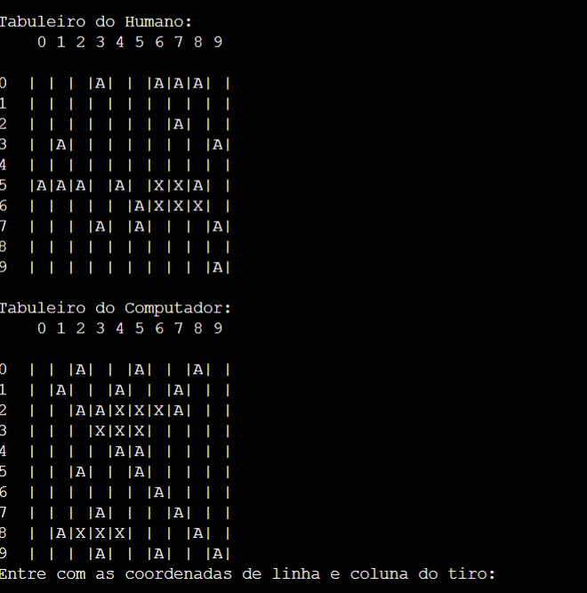

<h1 align="center"> Projeto C - Batalha Naval </h1>

Projeto em Linguagem C durante o curso Análise e Desenvolvimento de Sistemas pela Fatec Ipiranga.

---

 

  

---
## 💻 Tecnologias

Esse projeto foi desenvolvido com as seguintes tecnologias:

- Linguagem C
- Git e Github

---

## 🚧 Projeto

O nível de Dificuldade é Alto, pois o Computador está programado para quando acertar uma parte do navio, continuar para a direita, e caso não acerte 3 partes do Navio, ele volta para a esquerda do Primeiro tiro acertado até acertar as 3 Parte do Nível.
O programa utiliza Matrizes, Laços de Repetição, Arrays, Condicionais e Função #define em C.
O jogo é jogado com os Navios estando apenas na Horizontal para facilitar a Programação.
Projeto mais Completo e Complexo desenvolvido em Linguagem C durante o meu Curso.

Você pode ver o Projeto e testar neste link: [Batalha Naval - C](https://onlinegdb.com/jucUE1PmA)

--- 
